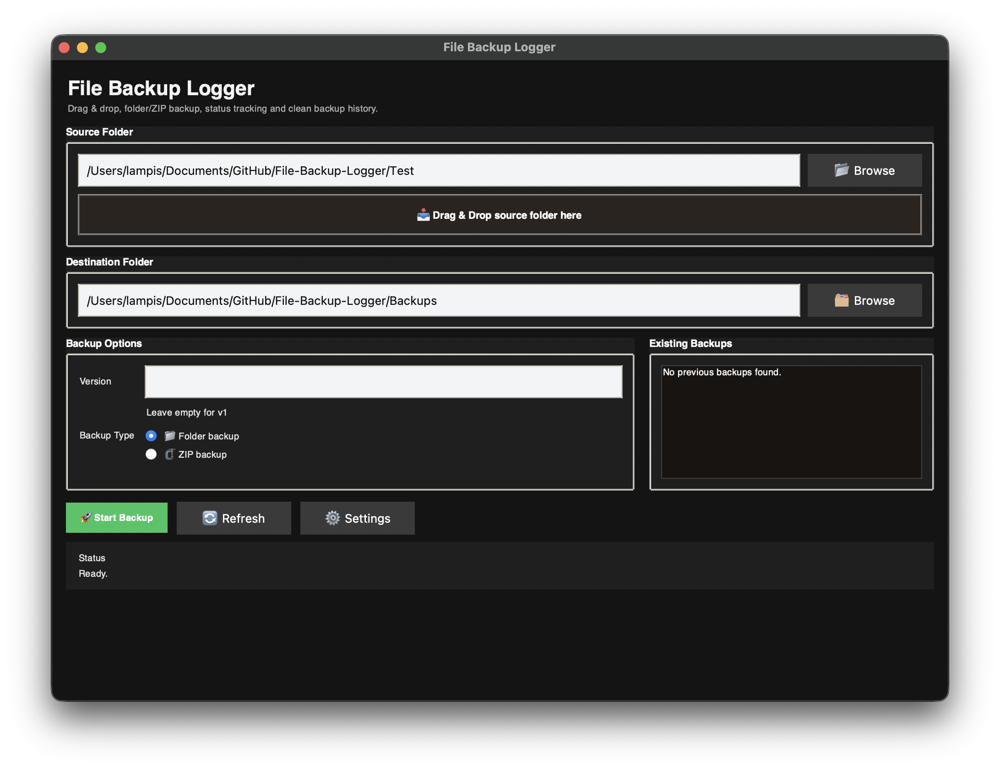
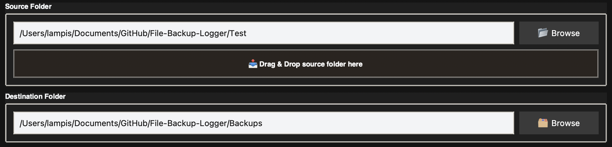
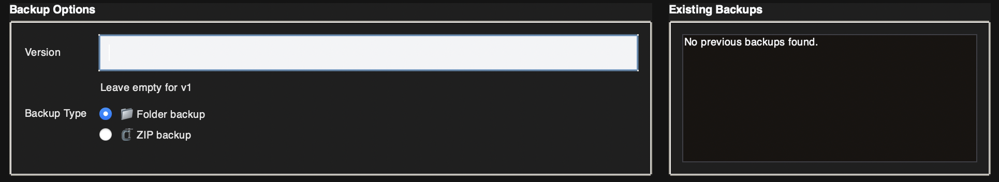
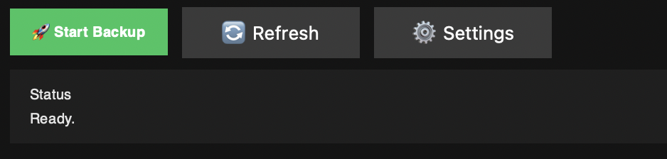
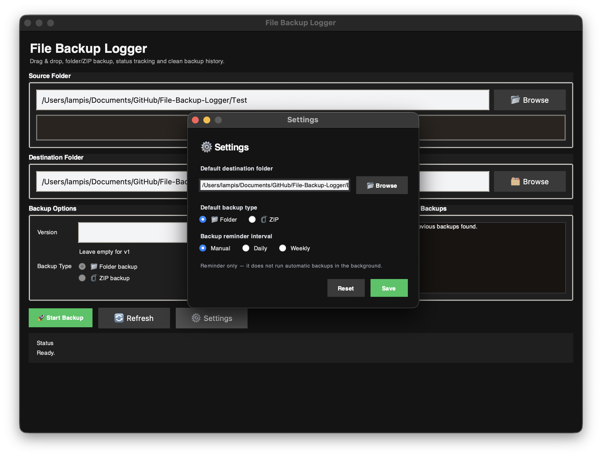
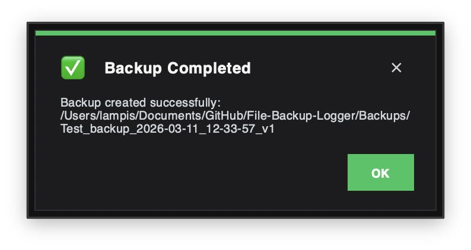
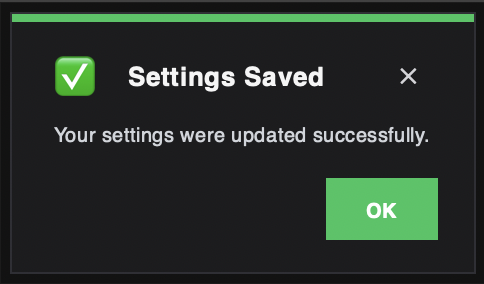

# File Backup Logger

## Description
File Backup Logger is a desktop backup application developed with Python and `tkinter`. It allows the user to create backups of folders either as normal copied folders or as compressed ZIP archives.  
The application provides a graphical user interface with drag-and-drop support, backup history display, 
logging, configuration storage, and reminder-based backup interval settings, offering a practical and user-friendly way to manage folder backups.

## Getting Started

There are two ways to run the application:

### 1) macOS app (`.app`)

- Download **File Backup Logger.zip**
- Unzip the file
- Open the generated **.app** to launch the application directly on macOS

> **Note:** To use the macOS application, the user should first download or clone the full project folder and then unzip the provided application file. The app stores its configuration and log data in the standard `config.json` file and log file used by the project.

---

### 2) Run from source (Python)

- Download (or clone) the full project folder
- Open a terminal in the project directory
- Move into the `Source_Code` folder
- Run the application:

```bash
python main.py
# or
python3 main.py
```

## User Interface Overview (Screenshots)


The application supports **drag-and-drop** functionality through the `tkinterdnd2` Python library, allowing the user to easily drop a folder into the designated area in order to select the **source folder** for the backup. Alternatively, the source folder can also be selected manually using the **Browse** button.  

To choose the **destination folder** of the backup, the user should use the corresponding **Browse** button and select the desired location where the backup will be stored.




After that, the user can choose the **type of backup**, which can be created either as a **folder backup** or as a **ZIP file**. The application also provides a field where the user can enter the **version** of the backup.  

On the right side of the interface, there is a panel that displays the **existing backups** of the selected folder inside the backup directory, showing them based on their **version** and **type/extension**.



At the bottom of the interface, the appropriate action buttons are provided, together with a **status area** that informs the user whether a backup is currently in progress or has been completed successfully. In addition, there is a **Settings** button, which allows the user to manage and customize the application preferences.





The application also provides several **notifications** related to system actions, such as backup completion, backup errors, reminders, and the successful saving of settings.



